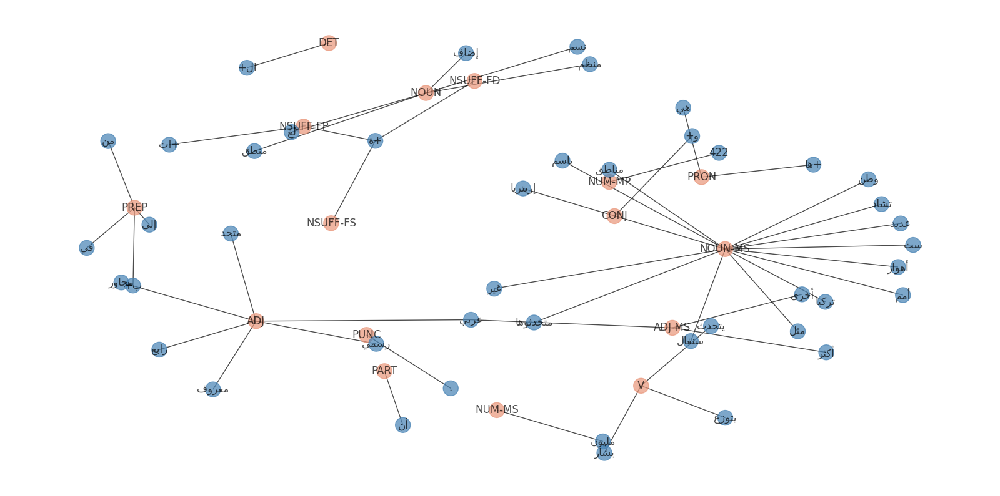

# arabic-pos-tagging

# Introduction

Part-of-speech (POS) tagging is a popular Natural Language Processing process which refers to categorizing words in a text (corpus) in correspondence with a particular part of speech, depending on the definition of the word and its context.

This approach aims to make Arabic POS-Tagging using [Farasa](https://farasa.qcri.org/) which is full-stack package to deal with Arabic Language Processing. 

# Requirmetns

```python
!pip install farasapy
!pip install arabic-reshaper
!pip install python-bidi
```

# Output

The input sample is:

يُشار إلى أن اللغة العربية يتحدثها أكثر من 422 مليون نسمة ويتوزع متحدثوها في المنطقة المعروفة باسم الوطن العربي بالإضافة إلى العديد من المناطق الأخرى المجاورة مثل الأهواز وتركيا وتشاد والسنغال وإريتريا وغيرها. وهي اللغة الرابعة من لغات منظمة الأمم المتحدة الرسمية الست.

The ouput of the POS Tagger is visualized using NetworkX.

<p align="center">
  
</p>